[Проект по учебной программме Flutter МФТИ ВШПИ, 2 курс, весна.

# Описание

**CatTinder** — приложение для просмотра и оценивания котов с возможностью получения дополнительной информации.

# Поддерживаемые платформы

На данный момент приложение протестировано, и готовы release-версии для Android, Windows и Web.

Возможная поддержка IOS, MacOS, Linux. Приложение на данный момент на этих платформах не проверялось.

* Android :white_check_mark:
* IOS :question:
* Windows :white_check_mark:
* Linux :question:
* MacOS :question:
* Web :white_check_mark:

# Возможности

## Визуальная часть и основная функциональность

* Реализованные экраны:

| 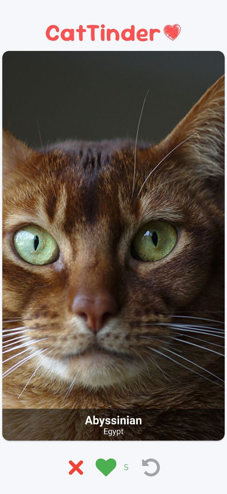 | 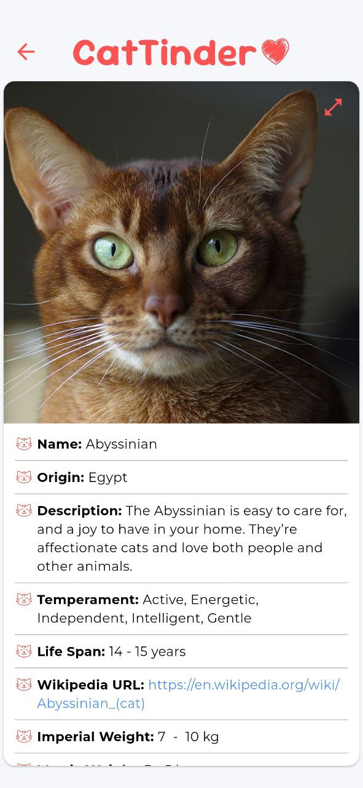 | 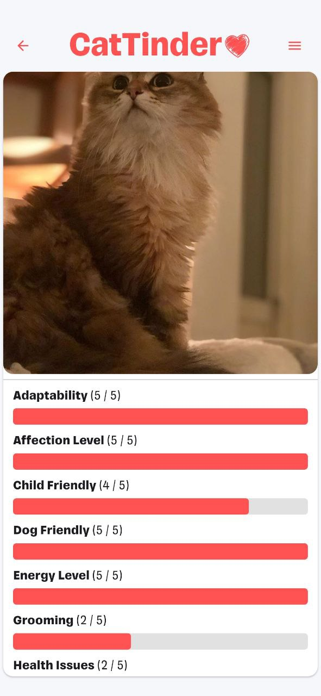 | 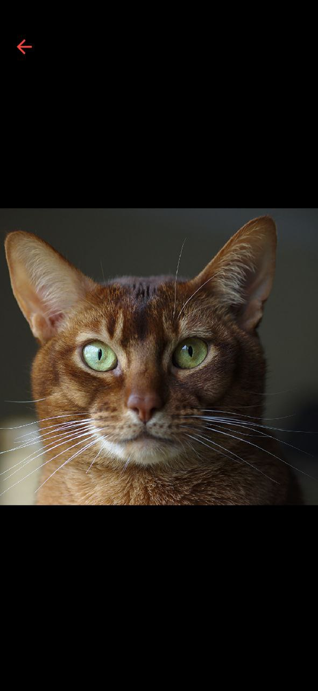 |
|-|-|-|-|
| Главный экран | Описание.   Часть 1 | Описание.   Часть 2 | Полноэкранный режим   изображения |

* Навигация слайдера явно в виде кнопок: ``Дизлайк``, ``Лайк`` и ``Назад``. При нажатии на первые две происходит смена слайда на следующий, если он есть. Если это был ``Лайк``, то увеличивается счётчик. Нажатие кнопки ``Назад`` возвращает предыдущий слайд, при этом отменяя лайк, если данная карточка была лайкнута.
* Навигация слайдера неявно в виде свайпов: доступны направления ``Право <=> Лайк`` и ``Лево <=> Дизлайк``.
* Каждый слайд отображает изображение кота, его породу и страну происхождения.
* При нажатии на слайд отображается подробная информация (порода, альтернативное название породы, страна происхождения, детальное описание, информация о характере животного, вес и продолжительность жизни и т. д.) и то же самое изображение кота.
* Для возможности корректного просмотра изображения реализован полноэкранный режим. Для перехода в него необходимо нажать по изображению на экране с дополнительной информацией. Это позволит приблизить, отдалить изображение и свободно передвигаться по нему жестами.
* Дополнительная информация о коте может содержать ссылку на страницу википедии, которая кликабельна и открывает браузер.
* Используется тематический индикатор загрузки в виде лапки кота при первой загрузке (на устройствах, не поддерживающих splash экран), в качестве индикатор.
* Счётчик лайков сохраняется локально. При повторном входе в приложение вы увидите то же самое число.
* Кастомная page transition для экрана с подробной информацией.
  
| 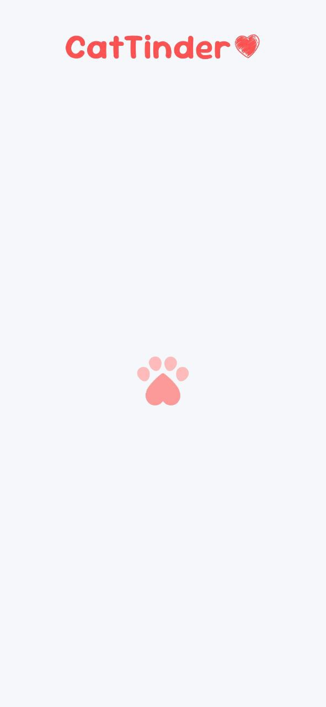 | 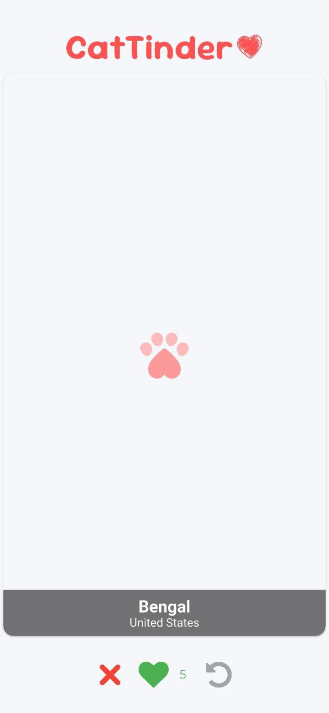 | 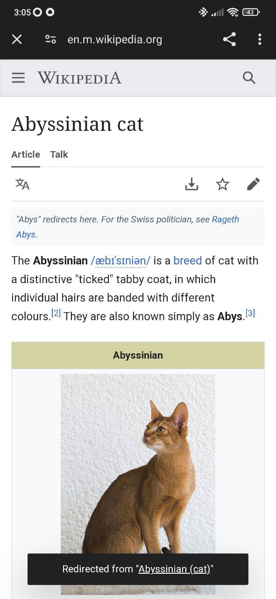 | 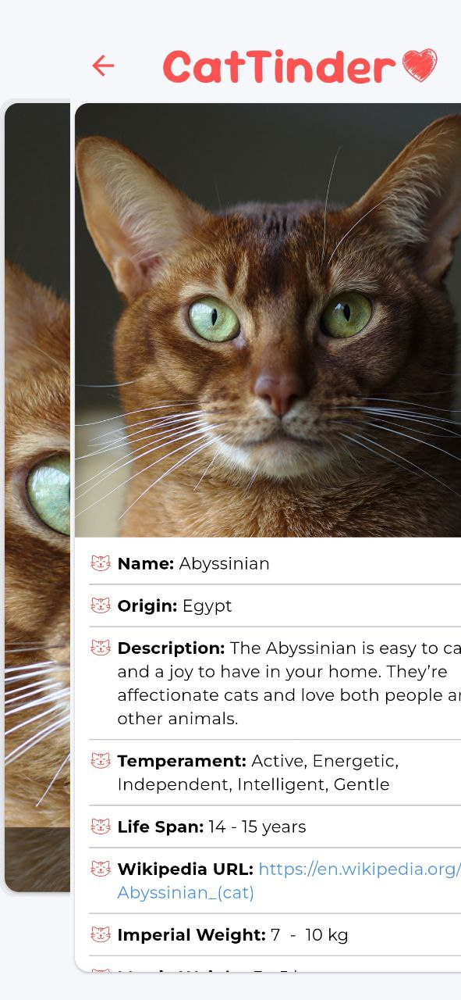 |
|-|-|-|-|
| Индикатор загрузки   для экрана | Индикатор загрузки   для изображения | Википедия | Пример page transition |

* Кастомный логотип с текстовым названием приложения и рукописным смайлом :heart:.

## Обработка ошибок
Система обработки ошибок позволяет восстанавливать (на самом деле не сбрасывает) полное состояние слайдера до возникновения ошибки, что важно для положительного опыта пользователя.
* При отсутствии интернета возникает соответствующая ошибка. Кнопка позволяет восстановиться пользователю, если соединение восстановится.
* При отсутствии интернета пользователь может просматривать уже полученные слайды и их подробное описание до момента, когда они не закончатся.
* Если слайды закончились, то возникает соответствующая ошибка.
* Дополнительно устанавливается ошибка, если произошла ошибка обращения к серверу при получении слайдов. Состояние приложения сохраняется, но пользователь не сможет просмотреть оставшиеся слайды, пока не устранится ошибка.
* Если произошла ошибка загрузки изображения, то появляется кнопка, по которой можно попробовать загрузить его снова. Например, если соединение было потеряно в ходе просмотра слайдов и изображение не успело загрузиться. Такое возможно, если интернета не было в момент перехода на данный слайд, а затем он появился. В противном случае изображение попробует загрузиться при навигации.

| 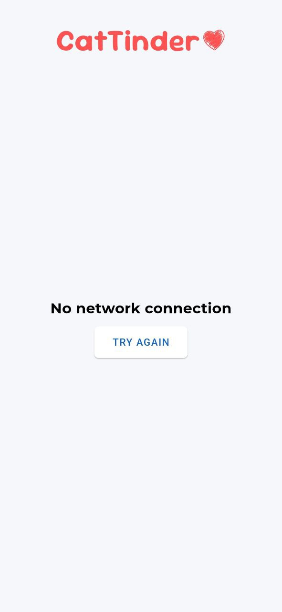 | 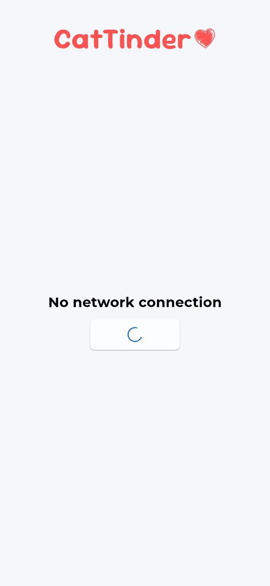 |  | 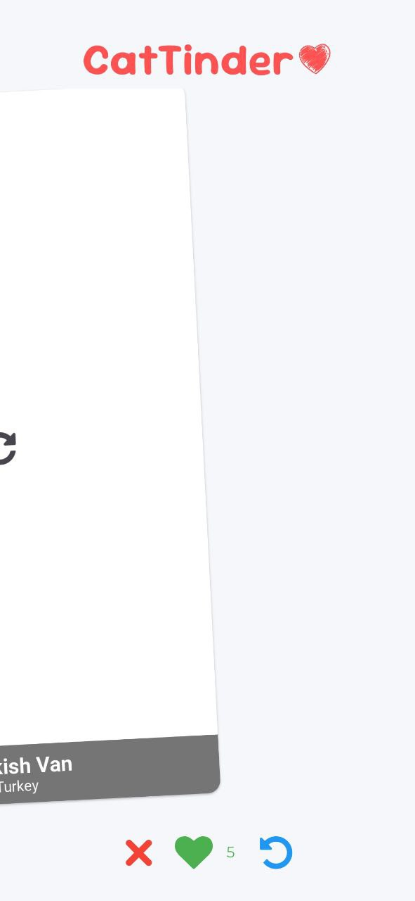 |
|-|-|-|-|
| Ошибка отсутствия интернета | Ошибка отсутствия интернета   (нажали кнопку) | Прочая ошибка | Последний слайд |

|  | 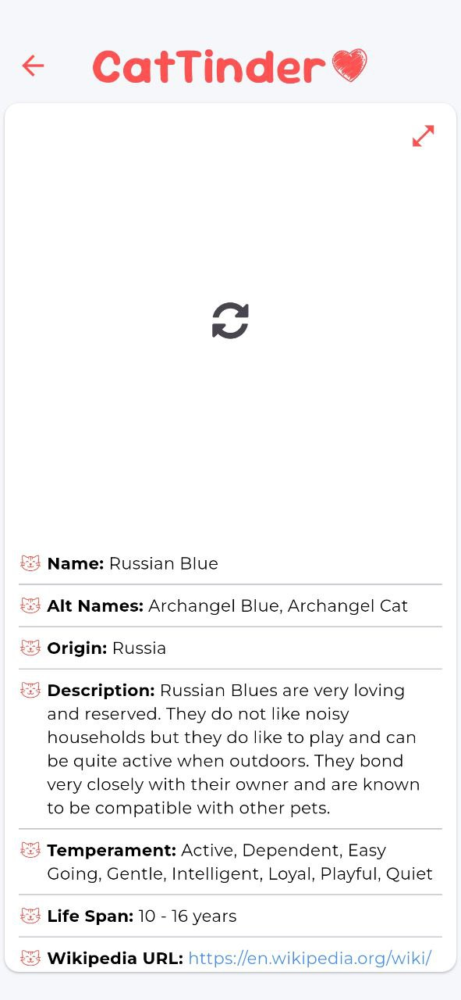 |
|-|-|
| Кнопка повторной загрузки.   Главный экран | Кнопка повторной загрузки.   Экран с описанием |

## Настройки приложения
* Зафиксирована портретная ориентация на каждом устройстве (включая IOS) для лучшего отображения изображений. Приложение открывается и работает в полноэкранном режиме: скрыты навигационная и статусная панели, которые можно открыть привычным способом (с дальнейшим восстановлением к исходному состоянию).
* Для каждой платформы установлена кастомная иконка.
* Для поддерживаемых платформ (Android, Web, IOS) установлен splash экран с логотипом приложения, который также используется в качестве первой стадии загрузки приложения.
* Установлено название CatTinder для каждой платформы.

| 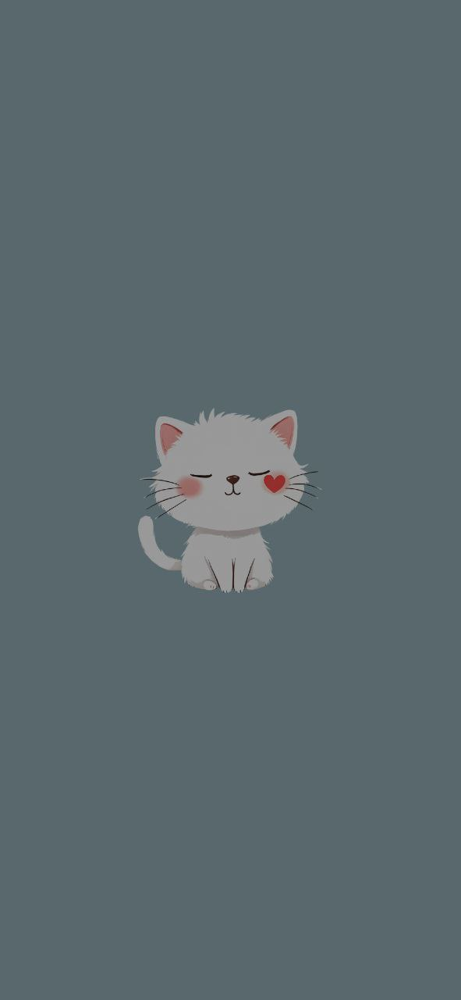 | 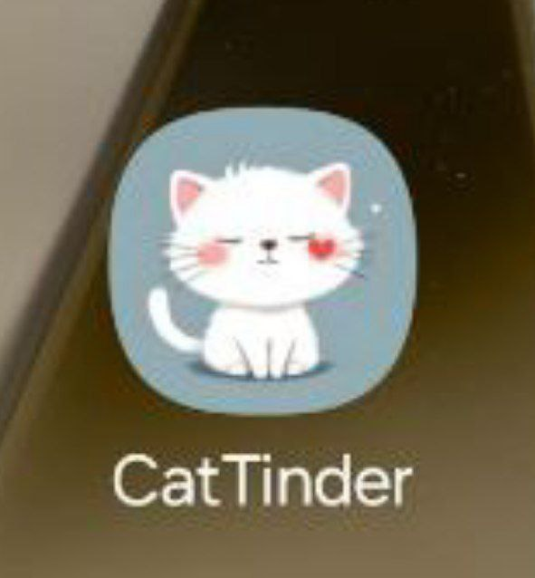 |
|-|-|
| Splash экран | Иконка приложения |

## Техническая часть

* Используется пакет ``http`` для получения запросов в API: https://thecatapi.com.
* Картинки получаются через endpoint ``/search``, устанавливаетcя флаг ``has_breeds=1``, чтобы содержалась подробная информация (в том числе и порода).
* Для отображения изображений используется виджет ``CachedNetworkImage``.
* В приложении используется два провайдера для удобства управлением состояния приложения и минимизации перерисовок виджетов. Главный, который управляет всем приложением, реализован через [provider](https://pub.dev/packages/provider), второй (scoped) же используется для удобной передачи информации о коте на другие экраны через ``InheritedWidget``. 
* Активно используется виджет ``Selector`` для обновления только затрагиваемых провайдером виджетов.
* Используется именованная навигация, которая определена через ``onGenerateRoute``.
* Для повторного обновления изображения при нажатии на соответствующую кнопку используется ``UniqueKey()`` и ``StatefulWidget``. Также ``StatefulWidget`` используется для создания анимированного индикатора загрузки в виде лапы (увеличение и уменьшение).
* Навигация (кнопки лайка, дизлайка и возвращения) реализованы через `StatelessWidget` и обращаются к провайдеру для получения информации.
* Реализована модель получаемых данных для удобства работы. Более того, используется безопасный каст, которые позволяет избежать ошибки, если данные придут не в ожидаемом формате.
* Если данные пустые или имеют `null`, то конкретно они не показываются в детальном описании.
* Используются виджеты `Row` и `Column` для построения более сложных виджетов: например, навигация слайдера и её расположение относительно слайдера соответственно.
* Используется `flutter_lint`, конфиги используемых пакетов для удобства вынесены в отдельные `.yaml` файлы с соответствующим наименованием.

# Установка приложения

Подробные инструкции по самостоятельной сборке для всех платформ вы найдете по пути [``app/build``](https://github.com/azinhoxx/cat_tinder/tree/main/app/build). Корректное поведение приложения на платформах IOS, MacOS, Linux не гарантировано.

## Windows

Используйте путь [``app/build/windows``](https://github.com/azinhoxx/cat_tinder/tree/main/app/build/windows), чтобы найти готовую сборку приложения под Windows.

Далее вы обнаружите директории [``installer``](https://github.com/azinhoxx/cat_tinder/tree/main/app/build/windows/installer) и [``runner``](https://github.com/azinhoxx/cat_tinder/tree/main/app/build/windows/runner), в которых соответственно находятся установщик и приложение, не требующее самостоятельной установки.

### Windows. Особенность установки.

Если вы используете [``installer``](https://github.com/azinhoxx/cat_tinder/tree/main/app/build/windows/installer), то будьте готовы к тому, что из самого установщика приложение не запустится из-за ошибки отсутствия ``.exe``. Это связано с проблемой сборщика и различия названий: ``CatTinder.exe`` устанавливается установщиком :vs: ``cat_tinder.exe`` пытается открыть установщик. 

## Android

Используйте путь [``app/build/android``](https://github.com/azinhoxx/cat_tinder/tree/main/app/build/android), чтобы найти готовую сборку приложения под Android.

Далее вы обнаружите директории [``apk/release``](https://github.com/azinhoxx/cat_tinder/tree/main/app/build/android/apk/release) и [``bundle/release``](https://github.com/azinhoxx/cat_tinder/tree/main/app/build/android/bundle/release), в которых соответственно находятся форматы APK и App bundle.

В директории [``apk/release``](https://github.com/azinhoxx/cat_tinder/tree/main/app/build/android/apk/release) также дополнительно находятся файлы формата APK под различные архитектуры: ``armeabi-v7a``, ``arm64-v8a``, ``x86_64``. Если вы уверены в архитектуре вашего устройства, то предпочтительнее использовать их: они весят меньше ввиду сборки под конкретную архитектуру.

## Web

Используйте путь [``app/build/web``](https://github.com/azinhoxx/cat_tinder/tree/main/app/build/web), чтобы найти готовую сборку приложения под Web.

Чтобы запустить, ``cd build/web`` из корня директории, и используйте ``python3 -m http.server 8080``.

# Особенности приложения

Из-за ограничения CORS в Web версии отсутствуют изображения, но остальная информация отображается корректно. Более того, дополнительная проверка интернета отключается — считается, что подключение всегда есть. В остальном приложение работает аналогично Windows, Android.

<u>На данный момент</u>:
1. Изображения котов на слайдах или в детальном описании могут отображаться некорректно — обрезано. Подробнее о временном решении этой проблемы было описано в возможностях приложения. 
2. Поддерживается только англоязычная версия. Нет возможности выбора русского языка.

# APK

Скачать APK последней версии можно по следующей ссылке: [APK](https://github.com/azinhoxx/cat_tinder/blob/3f8901fef7b94c5bd057f691fd38259c760cb0a8/app/build/android/apk/release/app-release.apk).
