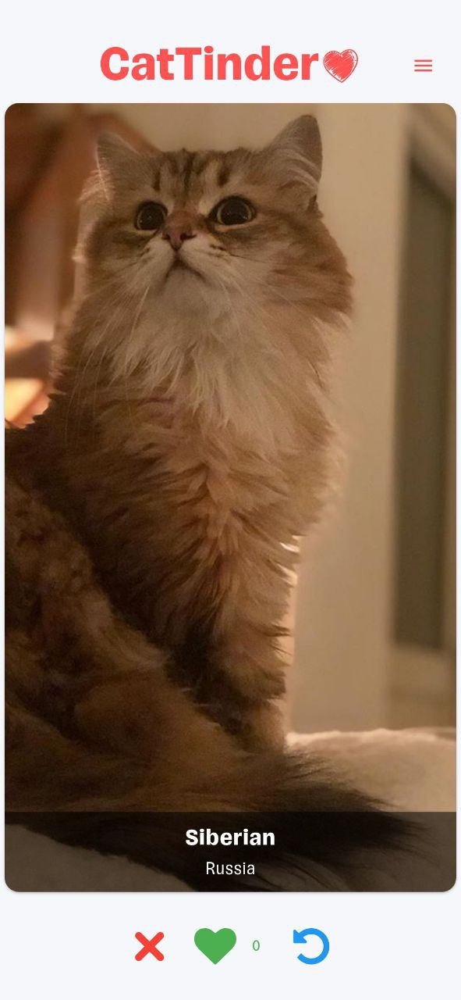

Проект по учебной программме Flutter МФТИ ВШПИ, 2 курс, весна.

# APK

Скачать APK последней версии можно по следующей ссылке: [APK](https://github.com/azinhoxx/cat_tinder/releases/latest/download/app-release.apk).

Release версии (Web, Windows, Android) с описанием изменений доступны по [ссылке](https://github.com/azinhoxx/cat_tinder/releases).

# ПОЛНОЭКРАННЫЙ РЕЖИМ

Полноэкранное отображение изображения — позволяет посмотреть изображение в полном формате с приближением, отдалением. Может быть полезно, если на двух предыдущих экранах изображение могло отобразиться некорректно.

# CI. GITHUB WORKFLOWS

Автоматический релиз версий для поддерживаемых платформ и проверка `flutter analyze`, `dart format`.

# Описание

**CatTinder** — Tinder-like приложение для котов.

# Поддерживаемые платформы

На данный момент приложение протестировано, и готовы release-версии для Android, Windows и Web.

* Android :white_check_mark:
* iOS :question:
* Windows :white_check_mark:
* Linux :question:
* macOS :question:
* Web :white_check_mark:

## Визуальная часть

- Главный экран — отображение слайдов котов. Есть возможность поставить лайк, дизлайк и отменить предыдущее действие — вернуться на предыдущий слайд.

- Экран с описанием — отображение изображения одного из представителей породы и её подробное описание.

  
  

- Полноэкранное отображение изображения — позволяет посмотреть изображение в полном формате с приближением, отдалением. Может быть полезно, если на двух предыдущих экранах изображение могло отобразиться некорректно.

- Экран с runtime-статистикой лайков — позволяет посмотреть текущие лайки в формате списка по породам. Могут быть дубли самих пород (как и во всём приложении), но отличаются изображениями. Более того, можно искать по названию породы: для этого реализовано поле с поиском.

## Ошибки

При загрузке приложения, как и во время получения данных может произойти ошибка. Уведомление о ней поступит в виде Alert Dialog. На данный момент он используется только при получении данных на главном экране, но не экране фильтрации (в силу runtime-реализации). При нажатии на кнопку обработки ошибки запускается повторное получение данных, визуально сопровождая это LinearSpinnerIndicator, тем самым показывая отзывчивость интерфейса.

Появление ошибки не ломает текущее состояние экрана. При потере связи в процессе перехода между слайдами она не отобразится до тех пор, пока пользователь не достигнет последнего — с него перемещение дальше будет не доступно.

## О разных видах загрузки

На первом изображении — на Android и Web поддерживается кастомный Splash-экран, который отображается во время первой **успешной** загрузки данных в приложении.

На втором gif загрузка на Windows — отображается тематический индикатор в виде лапки (gif в замедленном формате). Более того, можно видеть применение данного индикатора при загрузке изображений.

На третьем — отображение изображений в списке лайков при отсутствии активного подключения (например, если вы лайкнули тех котов, изображение которых ещё не прогрузилось).

Последняя gif отображается возможность самостоятельно загрузить изображение, если было потеряно подключение, но пользователь продолжал просматривать слайды.

  
  
  
  

# Особенности

Из-за CORS в Web-версии отсутствуют изображения.