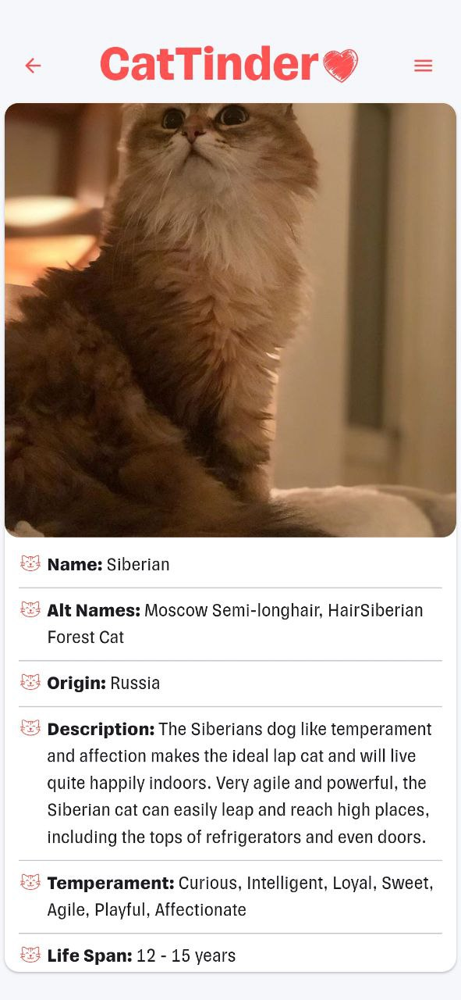

Проект по учебной программме Flutter МФТИ ВШПИ, 2 курс, весна.

# APK

Скачать APK последней версии можно по следующей ссылке: [APK](https://github.com/azinhoxx/cat_tinder/releases/latest/download/app-release.apk).

Release версии (Android, Windows) с описанием изменений доступны по [ссылке](https://github.com/azinhoxx/cat_tinder/releases).

## ВНЕ ТРЕБОВАНИЙ

### ПОЛНОЭКРАННЫЙ РЕЖИМ

Полноэкранное отображение изображения — позволяет посмотреть изображение в полном формате с приближением, отдалением. Может быть полезно, если на двух предыдущих экранах изображение могло отобразиться некорректно.

### ПОВТОРНАЯ ЗАГРУЗКА ИЗОБРАЖЕНИЯ

Если связь была потеряна в процессе работы, то некоторые изображения могут не загрузиться. При восстановлении связи можно самостоятельно загрузить изображение как на главном экране, так и на экране с детальным описанием (placeholder не является блокирующим и переход на экран с описанием всё еще работает).

  
  

### DISMISS-ВИБРАЦИЯ

При удалении кота из списка лайкнутых — происходит вибрация в момент, когда свайпнутый лот может быть удалён, что данное действие более понятным для пользователя.

### КАСТОМНЫЙ SPLASH-ЭКРАН

Позволяет избавить пользователя от двух типов загрузки на устройствах, где поддерживается splash-экран: от загрузки приложения и от получения данных при старте приложения.

На остальных устройствах данная загрузка заменяется на привычный paw-индикатор (который также используется во всех остальных загрузках изображений):

### CI. GITHUB WORKFLOWS

Автоматический релиз версий для поддерживаемых платформ и проверка `flutter analyze`, `dart format` и `flutter test`.

## Описание

**CatTinder** — Tinder-like приложение для котов.

## Поддерживаемые платформы

На данный момент поддерживаются только Android и Windows.

## Тестирование

HomeCubit и LikedCatsCubit покрыты на ~100% в рамках существующей реализации. Протестированы различные случаи возникновения ошибок, фильтрации, лайков и дизлайков.

## Оффлайн-режим

При работе с приложением могут происходить сбои в работе сети, которые могут повлиять на работу, пользователь автоматически уведомляется о такого рода ситуациях **не блокирующим** образом (пользователь может спокойно продолжать пользоваться приложением и листать слайды, пока они не закончатся):

  
  

Уведомление об отсутствии сети держится до того момента, пока пользователь сам его не уберет свайпом вниз или до появления сети.

Уведомление о появлении сети держится в течение 3-х секунд и автоматически скрывается.

Лайкнутые котики сохраняются локально, изображения кешируются и доступны в оффлайн-просмотре.

Автоматически при появлении сети происходит попытка запроса котов с сервера (для примера представлен случай, когда слайдов еще нет, аналогичная работа будет и в случае, когда доступных слайдов больше нет):

## Визуальная часть

- Главный экран — отображение слайдов котов. Есть возможность поставить лайк, дизлайк и отменить предыдущее действие — вернуться на предыдущий слайд.

- Экран с описанием — отображение изображения одного из представителей породы и её подробное описание.

  
  

- Полноэкранное отображение изображения — позволяет посмотреть изображение в полном формате с приближением, отдалением. Может быть полезно, если на двух предыдущих экранах изображение могло отобразиться некорректно.

- Экран с лайкнутыми котами — позволяет посмотреть текущие лайки в формате списка по породам. Могут быть дубли самих пород (как и во всём приложении, дубли удаляются только по id), но отличаются изображениями. Более того, можно искать по названию породы: для этого реализовано поле с поиском, которое без задержек обновляет список.

  
  

При ошибке загрузке изображения, появляется кастомный placeholder:

